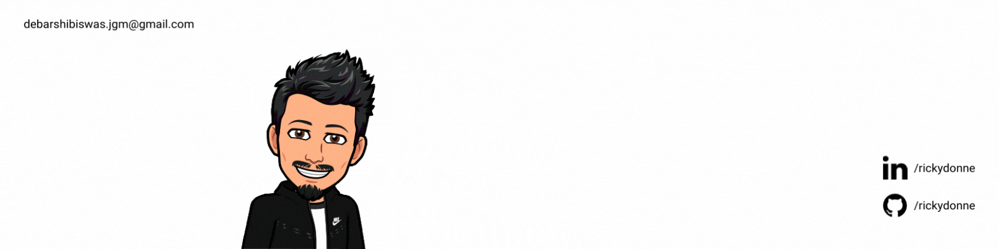

# Hello World! </h2>

## Hi there, My name is Debarshi Biswas, I also go by the name -[**Rick**](https://www.linkedin.com/in/rickydonne/) and welcome to my GitHub profile! :octocat:

I'm a **`Data analytics practitioner`** and a **`College Student`**!

❤️ **About Me:**

* 👩‍🎓 Learning Data Analysis and building ML models 
* ✍️ Currently pursuing Bachelor of Technology in Computer Science and Engineering from the [**Budge Budge Institute of Technology**](https://www.bbit.edu.in/)
* ✨ 2022 Goals: Start Contributing to Open Source Projects
* 📈 Interested in **`Predictive Analytics`** and **`Machine Learning`**

 **Languages/Tech Stack:** 

---

## View more repositories 👇
